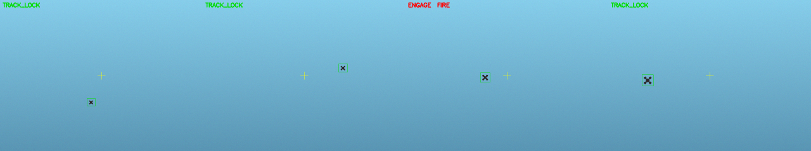

# ros2-counter-uav-turret

A ROS 2 simulation of an **autonomous counter-UAS (anti-drone) turret**: it detects a maneuvering aerial
target, tracks it, estimates its state, keeps a **stabilized pan/tilt gimbal locked on it**, and computes a
**lead (intercept) aim-point** for the fire solution — with an engagement state machine and safety interlocks.
End-to-end, closed-loop, runs headless (no hardware required).

> Built as a clean-room, generic reimplementation of the perception-and-control core I designed and led as
> team captain on an autonomous turret project (field-tested across 70+ recorded runs). The original
> competition code is private; this repository is an independent, public implementation of the same engineering.

> ✅ **Runs end-to-end** with no hardware: `python3 scripts/run_demo.py`. All nine nodes are implemented and
> unit-tested (29 tests); the numbers in [Results](#results) are measured, not placeholders.



*Left→right: acquire & TRACK_LOCK, tracking the maneuvering drone, ENGAGE+FIRE when the solution is valid,
still locked as the target closes. Yellow cross = boresight, green box = detection.*

## What it demonstrates
- **Detection → tracking → estimation → lead → stabilized control** as a real ROS 2 node graph.
- A **lead-angle (intercept) solver** — engaging a *moving* target, not a static one.
- A 6-state Kalman filter with **adaptive process noise, chi-square innovation gating and NIS telemetry**
  (it rejects bad measurements and reports its own consistency).
- C++ acceleration of the estimation hot path via
  [perception-accel](https://github.com/yasincavusoglu/perception-accel).

## Architecture

```
scenario_sim --/camera/image--> detector --/detections--> tracker --/tracks--> estimator
   (target + synthetic camera)     (YOLO)      (ByteTrack)      (6D Kalman: adaptive-Q + chi2 gating)
        ^                                                                            |
        | /gimbal/state                                                     /target/state
        |                                                                            v
   turret_plant <--/gimbal/cmd-- gimbal_control <--/aim/setpoint-- lead_solver   (intercept aim-point)
   (2nd-order dynamics)           (PID + stabilization)                 ^
                                                                   engagement_fsm  (SEARCH->LOCK->ENGAGE + safety)
                                                                        |
                                                                  hmi_telemetry  (live plots, JSONL logs, demo recording)
```

| Node | Role | Status |
|------|------|--------|
| `scenario_sim`   | maneuvering aerial target + synthetic camera + ground truth | ✅ |
| `detector`       | YOLOv8/v11 target detection | ✅ |
| `tracker`        | ByteTrack multi-object tracking | ✅ |
| `estimator`      | 6D Kalman (adaptive-Q, chi² gating, NIS) — C++ core | ✅ |
| `lead_solver`    | intercept/lead aim-point for a moving target | ✅ |
| `gimbal_control` | pan/tilt PID + stabilization (ros2_control) | ✅ |
| `turret_plant`   | 2nd-order gimbal dynamics (sim) | ✅ |
| `engagement_fsm` | SEARCH → TRACK_LOCK → ENGAGE + safety interlocks | ✅ |
| `hmi_telemetry`  | live plots, JSONL logs, demo recording | ✅ |

## The lead-angle solver (why it matters)
Static aim fails on a moving target. Given the estimated target state and the effector time-of-flight, the
solver iterates `t_impact = range / v_effector`, predicts the target forward by `t_impact`, and repeats until
convergence — producing an aim-point *ahead* of the target.

## Run

No ROS needed for the demo — pure-Python cores + a synthetic sensor:
```bash
pip install -r requirements.txt
python3 scripts/run_demo.py        # closed-loop engagement → prints metrics + writes docs/demo.png
python3 -m pytest test/            # 29 unit + integration tests
```
As a full ROS 2 (Humble) node graph:
```bash
colcon build && source install/setup.bash
ros2 launch counter_uav_turret sim.launch.py
```

## Results
Measured by `scripts/run_demo.py` (240-frame closed-loop engagement, monocular synthetic sensor):

| Metric | Value |
|--------|-------|
| Time to acquire & lock | ~0.07 s (frame 2 @ 30 fps) |
| Target kept in frame | 100 % |
| Gimbal tracking error (RMSE) | ~27 mrad (~1.5°) |
| Monocular range accuracy (RMSE) | ~11 m |
| Mean intercept lead applied | ~30 mrad (~1.7°) |

Range is the weak axis of a monocular sensor; **bearing** tracking is far more accurate, which is why the
gimbal keeps the target centered throughout. Reproduce with `python3 scripts/run_demo.py`.

## Roadmap
- [x] **M1 — Perception:** `scenario_sim` + `detector` + `tracker`
- [x] **M2 — Closed loop:** `estimator` + `lead_solver` + `gimbal_control` + `turret_plant`
- [x] **M3 — Showcase:** `engagement_fsm` + `hmi_telemetry` + demo (`scripts/run_demo.py`) + measured metrics
- [ ] **Next:** Gazebo/RViz2 3D view; real YOLO weights on real footage; MP4 recording

## Design notes & honesty
- Simulation only; the effector/ballistics model is simplified, not a validated weapon model.
- Detection uses a pretrained YOLO model (weights not included in the repo).
- The actuator interface is `ros2_control`; the original hardware system used a Fatek PLC over Modbus TCP.

## License
MIT — see [LICENSE](LICENSE).
